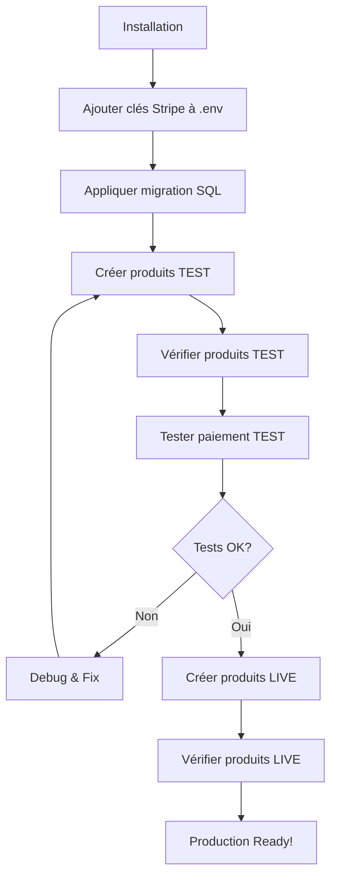

# Guide de Configuration Automatique des Produits Stripe

## Vue d'ensemble

Ce guide explique comment créer et gérer automatiquement les produits Stripe pour le système d'abonnements TwinForgeFit.

## 📋 Prérequis

### 1. Clés API Stripe

Vous aurez besoin des clés secrètes Stripe pour les deux environnements:

#### Mode Test (Développement)
```bash
STRIPE_TEST_SECRET_KEY=sk_test_...
```

#### Mode Live (Production)
```bash
STRIPE_LIVE_SECRET_KEY=sk_live_...
```

**Où trouver ces clés:**
1. Connectez-vous au [Stripe Dashboard](https://dashboard.stripe.com)
2. Allez dans **Developers > API keys**
3. Copiez la **Secret key** pour chaque mode
4. Ajoutez-les à votre fichier `.env` à la racine du projet

### 2. Installation des dépendances

```bash
npm install stripe
```

### 3. Appliquer la migration SQL

La migration ajoute des fonctions utilitaires pour gérer les Price IDs:

```bash
# Depuis votre projet Supabase
supabase db push
```

Ou via le dashboard Supabase:
- Allez dans **SQL Editor**
- Exécutez le contenu de `supabase/migrations/20251020130000_add_stripe_product_management_functions.sql`

## 🚀 Utilisation

### Étape 1: Créer les produits en mode Test

```bash
node scripts/create-stripe-products.js --mode=test
```

Ce script va:
1. ✅ Lire la configuration depuis `token_pricing_config`
2. ✅ Créer 7 produits Stripe (Essential, Pro, Elite, Champion, Master, Legend, Titan)
3. ✅ Créer les prix mensuels récurrents en EUR
4. ✅ Mettre à jour automatiquement la base de données avec les Price IDs
5. ✅ Afficher un rapport détaillé

**Sortie attendue:**
```
🚀 Création des produits Stripe en mode TEST

📊 Récupération de la configuration depuis Supabase...

✨ Création de 7 produits Stripe...

🔨 Création du produit: Essential (starter_9)
   Prix: 9€/mois | Tokens: 150,000
   ✅ Produit créé: prod_ABC123
   ✅ Prix créé: price_DEF456

[... autres produits ...]

📝 Mise à jour de la configuration dans Supabase...
✅ Configuration mise à jour dans Supabase

═══════════════════════════════════════════════════════════
🎉 CRÉATION DES PRODUITS STRIPE TERMINÉE
═══════════════════════════════════════════════════════════
```

### Étape 2: Vérifier les produits

```bash
node scripts/verify-stripe-products.js --mode=test
```

Ce script va:
1. ✅ Vérifier que tous les Price IDs sont configurés
2. ✅ Valider que les produits existent dans Stripe
3. ✅ Comparer les prix entre Stripe et Supabase
4. ✅ Détecter les incohérences

**Sortie attendue si tout est OK:**
```
🔍 Vérification des produits Stripe en mode TEST

[... vérifications ...]

═══════════════════════════════════════════════════════════
🎉 TOUT EST CONFIGURÉ CORRECTEMENT!
═══════════════════════════════════════════════════════════

✅ Tous les plans payants ont des Price IDs valides
✅ Tous les produits existent dans Stripe
✅ Les montants correspondent entre Stripe et Supabase

🚀 Le système de paiement est prêt à être utilisé!
```

### Étape 3: Tester un paiement

1. Allez sur `https://votre-app.com/settings?tab=subscription`
2. Cliquez sur un plan (par exemple "Pro")
3. Utilisez une carte test Stripe: `4242 4242 4242 4242`
   - Expiration: n'importe quelle date future
   - CVC: n'importe quel 3 chiffres
   - ZIP: n'importe quel code postal valide
4. Complétez le paiement
5. Vérifiez que:
   - ✅ L'abonnement apparaît dans `user_subscriptions`
   - ✅ Les tokens sont ajoutés dans `user_token_balance`
   - ✅ Une transaction est créée dans `token_transactions`

### Étape 4: Passer en Production

**⚠️ IMPORTANT: Ne passez en production qu'après avoir testé en mode test!**

```bash
# Créer les produits en mode LIVE
node scripts/create-stripe-products.js --mode=live

# Vérifier les produits LIVE
node scripts/verify-stripe-products.js --mode=live
```

**Checklist avant production:**
- [ ] Tous les tests en mode test ont réussi
- [ ] Les webhooks sont configurés pour l'URL de production
- [ ] `STRIPE_LIVE_SECRET_KEY` est définie
- [ ] Les produits de production sont vérifiés
- [ ] La documentation des prix est à jour

## 📊 Structure des Plans

Les plans créés sont basés sur la configuration dans `token_pricing_config`:

| Plan Key    | Nom        | Prix/mois | Tokens/mois | Description |
|-------------|------------|-----------|-------------|-------------|
| starter_9   | Essential  | 9€        | 150,000     | Plan de démarrage |
| pro_19      | Pro        | 19€       | 350,000     | Utilisateurs réguliers |
| premium_29  | Elite      | 29€       | 600,000     | Passionnés de fitness |
| elite_39    | Champion   | 39€       | 900,000     | Athlètes sérieux |
| expert_49   | Master     | 49€       | 1,200,000   | Professionnels |
| master_59   | Legend     | 59€       | 1,600,000   | Légendes du fitness |
| ultimate_99 | Titan      | 99€       | 3,000,000   | Plan ultime |

## 🔧 Fonctions SQL Utilitaires

### update_stripe_price_id

Met à jour manuellement un Price ID pour un plan:

```sql
SELECT update_stripe_price_id(
  'starter_9',              -- plan_key
  'price_ABC123',           -- stripe_price_id
  'prod_DEF456'             -- stripe_product_id (optionnel)
);
```

### validate_stripe_configuration

Valide que tous les plans ont des Price IDs:

```sql
SELECT * FROM validate_stripe_configuration();
```

Retourne:
```json
{
  "success": true,
  "configured_count": 7,
  "missing_count": 0,
  "missing_plans": [],
  "message": "All paid plans have Stripe Price IDs configured"
}
```

### get_plan_by_stripe_price_id

Retrouve un plan à partir d'un Price ID (utile pour les webhooks):

```sql
SELECT * FROM get_plan_by_stripe_price_id('price_ABC123');
```

## 🐛 Résolution de problèmes

### Erreur: "STRIPE_TEST_SECRET_KEY non définie"

**Solution:**
```bash
# Ajoutez à votre .env
STRIPE_TEST_SECRET_KEY=sk_test_VOTRE_CLE_ICI
```

### Erreur: "No active pricing configuration found"

**Solution:**
Vérifiez que la migration du système de tokens a été appliquée:
```sql
SELECT * FROM token_pricing_config WHERE is_active = true;
```

### Les produits existent déjà dans Stripe

Si vous réexécutez le script, de nouveaux produits seront créés. Pour éviter les doublons:

1. **Option 1: Supprimer les anciens produits**
   - Allez dans le Stripe Dashboard
   - Archivez les anciens produits
   - Relancez le script

2. **Option 2: Mettre à jour manuellement les Price IDs**
   ```sql
   SELECT update_stripe_price_id('starter_9', 'price_EXISTANT');
   ```

### Montants qui ne correspondent pas

Si le script détecte des incohérences:

1. Vérifiez la configuration dans Supabase:
   ```sql
   SELECT subscription_plans FROM token_pricing_config WHERE is_active = true;
   ```

2. Comparez avec les prix dans Stripe Dashboard

3. Mettez à jour soit Stripe soit Supabase pour qu'ils correspondent

## 🔄 Workflow complet



## 📚 Ressources

- [Stripe Products Documentation](https://stripe.com/docs/products-prices/overview)
- [Stripe Testing](https://stripe.com/docs/testing)
- [Supabase Edge Functions](https://supabase.com/docs/guides/functions)
- [Guide principal Stripe](../STRIPE_SETUP.md)

## 🆘 Support

Si vous rencontrez des problèmes:

1. Vérifiez les logs des scripts
2. Consultez le [Stripe Dashboard](https://dashboard.stripe.com) pour les erreurs
3. Vérifiez les données dans Supabase
4. Exécutez le script de vérification pour un diagnostic

## 📝 Notes importantes

- ⚠️ **Ne commitez JAMAIS les clés secrètes Stripe dans Git**
- ⚠️ **Testez toujours en mode test avant la production**
- ⚠️ **Gardez les Price IDs synchronisés entre Stripe et Supabase**
- ✅ **Utilisez toujours les scripts pour créer les produits (pas manuellement)**
- ✅ **Vérifiez la configuration après chaque modification**

## 🔐 Sécurité

- Les clés secrètes sont lues depuis `.env` (non versionné)
- Les scripts utilisent la service_role de Supabase
- Les Price IDs sont stockés en base de données de manière sécurisée
- Les webhooks Stripe valident les signatures

## 🎯 Checklist de déploiement

### Mode Test
- [ ] `STRIPE_TEST_SECRET_KEY` configurée
- [ ] Migration SQL appliquée
- [ ] Produits créés (`create-stripe-products.js --mode=test`)
- [ ] Produits vérifiés (`verify-stripe-products.js --mode=test`)
- [ ] Paiement test réussi
- [ ] Webhooks test configurés

### Mode Production
- [ ] Tous les tests en mode test passent
- [ ] `STRIPE_LIVE_SECRET_KEY` configurée
- [ ] Produits créés (`create-stripe-products.js --mode=live`)
- [ ] Produits vérifiés (`verify-stripe-products.js --mode=live`)
- [ ] Webhooks production configurés
- [ ] Test avec vraie carte bancaire
- [ ] Monitoring Stripe activé
- [ ] Documentation à jour
